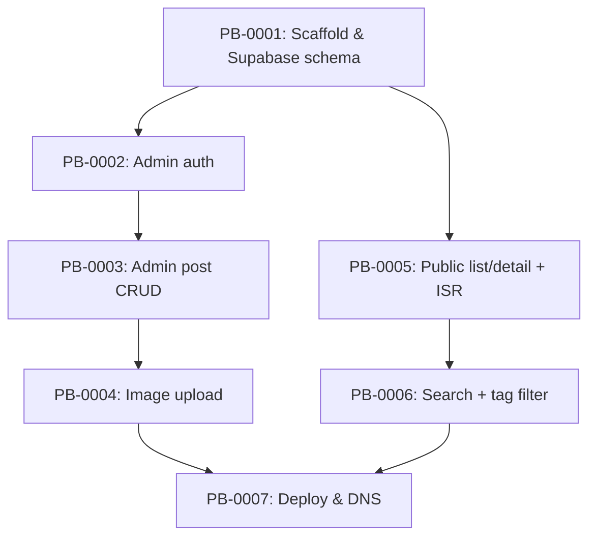

# Ticket Breakdown — Personal Blog Platform

## Epic summary

Ship a single-admin personal blog (Next.js + Supabase) so Jason can publish weekly write-ups —
text, code snippets, images — from a session-gated admin UI, with a public post list/detail
reading experience (search, tags, dark mode) live at `blog.developerjay.com`. Greenfield: no app
scaffold exists yet, so this breakdown covers MVP phases, not epic-on-existing-code slicing.

Source docs: `personal-blog-platform.prd.md` (PRD §1–9 + Architecture, same file) ·
`.claude/references/data-model.md` · `.claude/references/supabase-access-control.md`.

## Tickets

- [PB-0001 — Project scaffold, Supabase schema, and shared infra](pb-0001.md)
- [PB-0002 — Admin authentication (login + middleware gating)](pb-0002.md)
- [PB-0003 — Admin post CRUD (create, edit, delete, draft/publish)](pb-0003.md)
- [PB-0004 — Image upload to Storage](pb-0004.md)
- [PB-0005 — Public post list + detail pages (ISR + markdown rendering)](pb-0005.md)
- [PB-0006 — Search + tag filtering (public)](pb-0006.md)
- [PB-0007 — Deploy & DNS](pb-0007.md)

## Dependency graph

## Suggested execution order

- **Wave 1:** PB-0001 (everything depends on it — do this first, solo).
- **Wave 2 (parallel):** PB-0002, PB-0005 — both depend only on PB-0001, touch disjoint file
  trees (`/admin` + `proxy.ts` vs. `app/(public)/`), safe to run in separate worktrees.
- **Wave 3:** PB-0003 (needs PB-0002's gated admin layout to build the CRUD UI inside).
- **Wave 4 (parallel):** PB-0004 (needs PB-0003's post editor), PB-0006 (needs PB-0005's public
  list page) — disjoint file trees (`app/admin/posts/` vs. `app/(public)/`), safe to parallelize.
- **Wave 5:** PB-0007 (needs the full feature set from PB-0004 and PB-0006 before going live).

Plan just-in-time: don't plan PB-0003 in detail until PB-0002 is actually implemented (its auth
pattern shapes how the admin layout/session check gets consumed); same for PB-0004 waiting on
PB-0003's `PostForm.tsx`, and PB-0006 waiting on PB-0005's list-page data-fetching shape.
